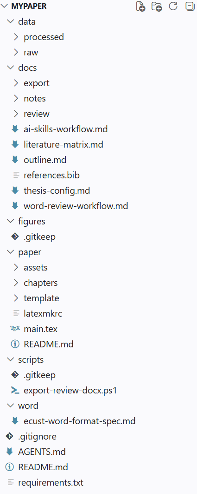
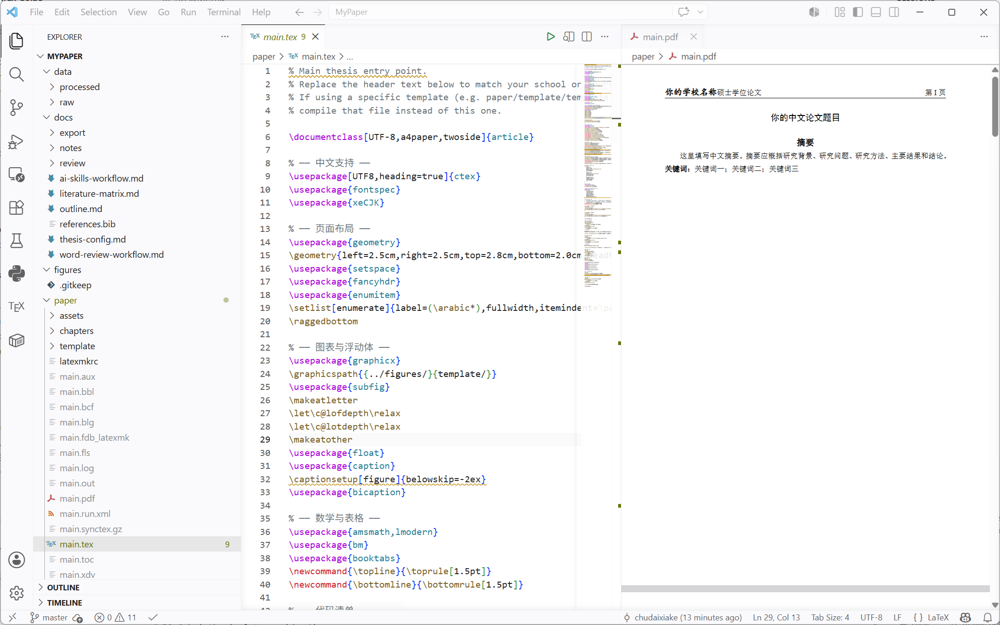
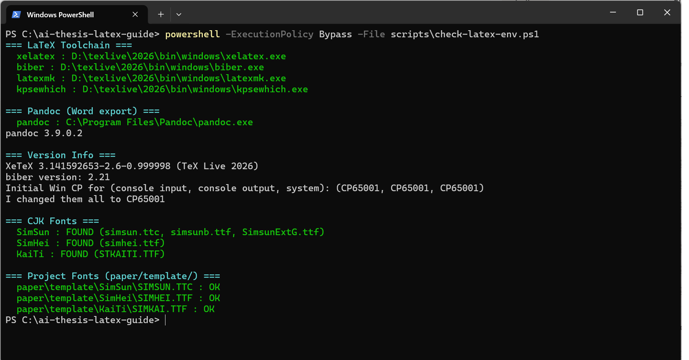
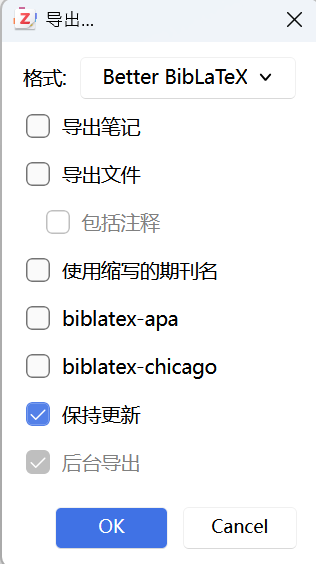
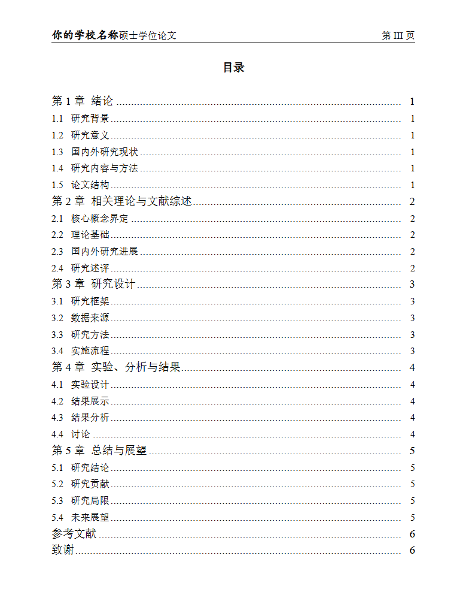

# AI Academic Writing LaTeX Guide

面向**通用学术写作**的项目化工作流：用 TeX Live / LaTeX 管正式排版，用 Zotero 管参考文献，用 Codex 或 Claude Code 辅助写作、检查引用、处理审稿人/导师批注。

> 本项目不是任何学校或机构的官方发布页。内置默认模板基于华东理工大学硕士论文格式作为示例，但你可以使用**任何学校学位论文或期刊的 LaTeX 模板**——只需把模板文件给 Codex / Claude Code，它会在生成项目骨架后自动适配。正式提交前请以目标（学校研究生院 / 期刊编辑部）给出的最新要求为准。若使用第三方模板，请遵守对应许可证并保留必要署名。

> 运行 init 脚本后的项目目录结构（VS Code 资源管理器或文件管理器）。

<div align="center">
  
</div>

## 这个项目解决什么

它把从零开始写学术论文需要配置的内容整理成一套可复制流程：

- 安装 TeX Live、VS Code、LaTeX Workshop、Zotero、Better BibTeX。
- 安装适合学术写作的 Codex skills。
- 一键生成类似 `D:\MyPaper` 的学术写作项目目录。
- 默认生成符合内置 LaTeX 格式模板（ECUST 硕士论文示例）的项目骨架；**想用其他模板（学校论文 / 期刊投稿）？把 LaTeX 模板给 Codex，它在生成项目结构后自动适配。**
- 建立 `AGENTS.md`，让 Codex / Claude Code 每次都按固定流程工作。
- 管理 Zotero 导出的 `references.bib`。
- 提供 LaTeX 正式稿 + Word 导师批注稿的双轨流程。
- 从默认 LaTeX 模板中提取 Word 格式映射规格，作为生成 Word 审阅模板的依据。

## 本次更新：轻量 AI 写作 Harness

这次更新把项目从“目录骨架 + 写作提示”进一步升级为“可控的 AI 学术写作工作台”。新生成的项目会内置一套轻量 Harness，用来约束 Codex / Claude Code 的工作流程：

- `docs/workflow/writing-pipeline.md`：把论文写作拆成项目配置、大纲确认、文献整理、单元写作、引用检查、LaTeX 验证、Word 审阅和交付总结等阶段。
- `docs/workflow/quality-gates.md`：把“不编造引用”“不误改模板”“优先编译检查”“保留待确认标记”等要求写成可复查的质量门禁。
- `docs/workflow/change-log-template.md`：为每轮重要写作、模板适配或审稿修改提供工作日志模板。
- `docs/worklog/`：沉淀每次修改的输入材料、修改范围、验证结果和遗留问题，避免长周期论文写作中上下文丢失。

它的目标不是让 AI 一次性写完整篇论文，而是让 AI 按“计划 → 修改 → 检查 → 记录”的节奏工作。这样更适合真实论文场景：文献不能编造，格式不能乱改，导师批注要可追踪，LaTeX 修改后要能验证。

## 最短路径

已经安装好 TeX Live、VS Code、Zotero、Pandoc，并且 Codex skills 也装好后，只需要：

**Windows (PowerShell)：**

```powershell
git clone https://github.com/chudaixiake/ai-thesis-latex-guide.git D:\ai-thesis-latex-guide
cd D:\ai-thesis-latex-guide
powershell -ExecutionPolicy Bypass -File scripts/init-thesis-project.ps1 -Destination D:\MyPaper
```

**macOS / Linux (bash)：**

```bash
git clone https://github.com/chudaixiake/ai-thesis-latex-guide.git ~/ai-thesis-latex-guide
cd ~/ai-thesis-latex-guide
bash scripts/init-thesis-project.sh ~/MyPaper
```

然后进入新项目：

```powershell
cd D:\MyPaper
```

让 Codex 或 Claude Code 开始：

```text
请阅读 AGENTS.md、docs/thesis-config.md、docs/outline.md、docs/ai-skills-workflow.md 和 docs/workflow/writing-pipeline.md，之后按这些规则协助我写论文。
```

## 最终生成的项目

运行本项目的初始化脚本后，会生成类似：

```text
D:\MyPaper
├─ AGENTS.md
├─ README.md
├─ docs
│  ├─ thesis-config.md          ← 填写题目、学院、研究问题等（含示例）
│  ├─ outline.md
│  ├─ literature-matrix.md
│  ├─ references.bib
│  ├─ ai-skills-workflow.md
│  ├─ word-review-workflow.md
│  ├─ workflow
│  │  ├─ writing-pipeline.md
│  │  ├─ quality-gates.md
│  │  └─ change-log-template.md
│  ├─ worklog
│  ├─ export
│  ├─ review
│  └─ notes
├─ paper
│  ├─ main.tex                  ← 通用入口，页眉已可配置
│  ├─ latexmkrc
│  ├─ chapters
│  │  ├─ 01-introduction.tex    ← 含写作指引注释
│  │  ├─ 02-literature.tex
│  │  ├─ 03-method.tex
│  │  ├─ 04-analysis.tex
│  │  └─ 05-conclusion.tex
│  ├─ assets
│  └─ template                 ← 默认 ECUST 模板（请替换为你自己的）
├─ figures
├─ data
│  ├─ raw
│  └─ processed
├─ scripts
│  ├─ export-review-docx.ps1
│  └─ export-review-docx.sh
└─ word
   └─ ecust-word-format-spec.md
```

其中：

- `AGENTS.md`：给 Codex / Claude Code 的长期项目规则。
- `docs/thesis-config.md`：题目、学院、专业、导师、研究问题、方法等（含填写示例）。
- `docs/outline.md`：论文大纲。
- `docs/references.bib`：Zotero Better BibTeX 自动导出的参考文献库。
- `docs/ai-skills-workflow.md`：论文各阶段应该调用哪些 skills。
- `docs/workflow/`：AI 写作流程、质量门禁和工作日志模板，约束重大写作任务按计划、验证、追踪推进。
- `docs/worklog/`：记录每轮重要写作、模板适配或审稿修改的输入、范围、验证结果和遗留问题。
- `docs/word-review-workflow.md`：导师 Word 批注往返流程。
- `paper/`：LaTeX 主稿。`main.tex` 的页眉通过 `\SchoolName` 和 `\ThesisType` 命令配置。
- `word/ecust-word-format-spec.md`：从华理 LaTeX 模板提取的 Word 格式映射。

## 第 1 步：安装基础软件

必须安装：

- TeX Live，建议完整安装。
- VS Code。
- LaTeX Workshop 插件。
- Zotero。
- Better BibTeX 插件。
- Pandoc（用于 Word 导出）。

安装和检查说明：

- [安装 TeX Live](docs/01-install-texlive.md)
- [配置 VS Code 与 LaTeX Workshop](docs/02-vscode-latex-workshop.md)
- [配置 Zotero 与 Better BibTeX](docs/03-zotero-better-bibtex.md)
- [常见编译问题](docs/05-troubleshooting.md)

> VS Code 中 LaTeX Workshop 编译成功（左侧 .tex、右侧 PDF 预览）。

<div align="center">
  
</div>

环境检查：

**Windows：**

```powershell
powershell -ExecutionPolicy Bypass -File scripts/check-latex-env.ps1
```

**macOS / Linux：**

```bash
bash scripts/check-latex-env.sh
```

应能找到：

```text
xelatex
biber
latexmk
kpsewhich
pandoc
```

如果电脑同时有 MiKTeX 和 TeX Live，确保 TeX Live 排在 PATH 前面：

```text
D:\texlive\2026\bin\windows
```

> 运行环境检查脚本后的终端输出（所有工具显示 OK / FOUND）。

<div align="center">
  
</div>

## 第 2 步：安装学术写作 skills

推荐安装并使用这些 skills。

通用学术论文流程：

- `academic-pipeline`
- `academic-paper`
- `deep-research`
- `academic-paper-reviewer`
- `awesome-ai-research-writing`
- `humanizer`
- `doc-coauthoring`

Nature 风格科研写作：

- `nature-academic-search`
- `nature-reader`
- `nature-writing`
- `nature-citation`
- `nature-polishing`
- `nature-data`
- `nature-figure`
- `nature-response`
- `nature-paper2ppt`

Nature skills 来源：

```text
https://github.com/Yuan1z0825/nature-skills
```

在 Codex 中可以直接说：

```text
从 Yuan1z0825/nature-skills 安装所有 skills
```

手动安装命令：

```powershell
python "$env:USERPROFILE\.codex\skills\.system\skill-installer\scripts\install-skill-from-github.py" `
  --repo Yuan1z0825/nature-skills `
  --path skills/nature-academic-search `
         skills/nature-citation `
         skills/nature-data `
         skills/nature-figure `
         skills/nature-paper2ppt `
         skills/nature-polishing `
         skills/nature-reader `
         skills/nature-response `
         skills/nature-writing
```

安装后重启 Codex。

更详细说明见：

[安装和使用 Codex Skills](docs/06-codex-skills.md)

## 第 3 步：一键创建学术写作项目

在本教程仓库根目录运行：

**Windows：**

```powershell
cd D:\ai-thesis-latex-guide
powershell -ExecutionPolicy Bypass -File scripts/init-thesis-project.ps1 -Destination D:\MyPaper
```

**macOS / Linux：**

```bash
cd ~/ai-thesis-latex-guide
bash scripts/init-thesis-project.sh ~/MyPaper
```

这个命令会：

- 复制 `scaffold/thesis-project/` 到目标目录。
- 创建 `docs/`、`paper/`、`data/`、`figures/`、`scripts/`、`word/` 等目录。
- 写入 `AGENTS.md`、大纲、章节占位（含写作指引注释）、AI skills 流程、Word 审阅流程。
- 从 `format/template/ecust-master/` 复制默认格式模板（ECUST 硕士论文示例）到 `paper/template/`。**这只是初始占位——接下来你可以替换为任何学校或期刊的模板。**
- 初始化 Git 并提交第一版。

### 替换为你自己的模板（生成骨架之后）

项目骨架生成完成后，把你目标学校或期刊的 LaTeX 模板交给 Codex：

```text
我要使用 [XX大学硕士论文 / XX期刊] 的 LaTeX 模板，
模板文件在 [路径]，请帮我调整 paper/template/ 下的文件以匹配该模板格式，
并确保 main.tex 正确引用该模板。
```

Codex 会自动完成模板适配，无需手动修改大量配置。

详细说明：

[一键创建论文项目](docs/08-one-command-thesis-project.md)

## 第 4 步：配置 Zotero 参考文献

在 Zotero 中新建 Collection：

```text
MyPaper
```

右键导出：

```text
Export Collection...
```

格式选择：

```text
Better BibLaTeX
```

勾选：

```text
Keep updated
```

保存到：

```text
D:\MyPaper\docs\references.bib
```

> Zotero 中设置 Better BibTeX 自动导出（Export Collection + Keep updated）。

<div align="center">
  
</div>

LaTeX 中引用：

```latex
\cite{yourCitationKey}
```

## 第 5 步：让 Codex 或 Claude Code 开始干活

进入生成后的项目，先让 AI 读取规则：

```text
请阅读 AGENTS.md、docs/thesis-config.md、docs/outline.md、docs/ai-skills-workflow.md 和 docs/workflow/writing-pipeline.md，之后按这些规则协助我写论文。
```

补全论文配置：

```text
根据我的题目和研究方向，帮我补全 docs/thesis-config.md。不确定的地方标注 [待确认]。
```

细化大纲：

```text
使用 academic-paper，基于 docs/thesis-config.md，帮我细化 docs/outline.md。
```

写章节：

```text
使用 academic-paper 和 nature-writing，直接修改 paper/chapters/01-introduction.tex。
目标：补全研究背景和研究意义。
依据：docs/thesis-config.md、docs/outline.md、docs/references.bib。
限制：不要编造引用；没有来源的位置用 [需要引用] 标记。
```

查引用：

```text
使用 nature-citation，检查 paper/chapters 中所有 citation key 是否存在于 docs/references.bib。
```

审稿：

```text
使用 academic-paper-reviewer，按硕士论文标准审查当前论文结构、论证、方法、引用和格式问题。
```

## 第 6 步：编译 LaTeX/PDF

简化模板：

```powershell
cd D:\MyPaper\paper
latexmk -xelatex main.tex
```

如果使用 `paper/template/` 中的默认模板：

```powershell
cd D:\MyPaper\paper\template
latexmk -xelatex template.tex
```

参考文献使用：

```latex
\usepackage[backend=biber,style=gb7714-2015,gbalign=left,gbnamefmt=lowercase]{biblatex}
```

> 编译成功后生成的 PDF 效果图。

<div align="center">
  
</div>

## 第 7 步：处理老师 Word 批注

推荐双轨制：

```text
PDF：看最终格式
Word：给导师批注文字
```

导出 Word 审阅稿：

**Windows：**

```powershell
cd D:\MyPaper
powershell -ExecutionPolicy Bypass -File scripts/export-review-docx.ps1
```

**macOS / Linux：**

```bash
cd ~/MyPaper
bash scripts/export-review-docx.sh
```

或从本教程仓库对指定项目导出：

```powershell
cd D:\ai-thesis-latex-guide
powershell -ExecutionPolicy Bypass -File scripts/export-review-docx.ps1 -ProjectRoot D:\MyPaper
```

默认输出：

```text
D:\MyPaper\docs\export\review-draft.docx
```

建议同时给导师：

```text
docs/export/review-draft.pdf
docs/export/review-draft.docx
```

### Word 导出的已知限制

Pandoc 将 LaTeX 转为 Word 时，以下格式会丢失或不完全：

- 页眉页脚（学校名称、页码样式）
- 中文字体（宋体、黑体、楷体）
- 目录样式
- 标题编号格式
- 双语图表题注

`word/ecust-word-format-spec.md` 提供了格式映射规格，导师批注时可以参考该文件手动调整 Word 样式。批注的重点是文字内容而非排版，格式以最终 LaTeX/PDF 为准。

导师返回批注后放入：

```text
docs/review/
```

再让 AI 处理：

```text
请读取 docs/review/supervisor-comments-YYYYMMDD.docx，整理导师所有批注和修改建议，生成 docs/revision-roadmap-YYYYMMDD.md。
```

然后：

```text
根据 docs/revision-roadmap-YYYYMMDD.md，逐条修改 paper/chapters 中对应章节。不要改动未提到的内容。
```

详细说明：

[Word 批注往返流程](docs/09-word-review-workflow.md)

## 第 8 步：Word 格式映射

如果需要让 Word 审阅稿尽量接近 LaTeX 模板格式，参考：

```text
word-template/ecust-word-format-spec.md
```

该文件从默认 LaTeX 模板提取：

- 页面设置
- 正文字体和段落
- 页眉页脚
- 目录
- 标题样式
- 摘要和关键词
- 图表题注
- 参考文献

详细说明：

[从 LaTeX 模板提取 Word 格式](docs/10-ecust-word-format-spec.md)

## 仓库结构

```text
docs/          教程文档
format/        内置默认 LaTeX 格式模板（ECUST 硕士论文，作为示例）
scaffold/      可复制的完整学术写作项目骨架
scripts/       检查、初始化、模板准备、Word 导出脚本（PowerShell + bash）
template/      原创简化 LaTeX 示例模板
word-template/ 从 LaTeX 模板提取的 Word 格式映射
.github/       CI 工作流（自动编译 LaTeX）
```

`format/template/ecust-master/` 是初始化脚本默认使用的格式源（作为占位示例）。生成 `D:\MyPaper` 时，脚本会把它复制到 `D:\MyPaper\paper\template`。**接下来你应该替换为自己实际的学校或期刊模板。**

## 推荐阅读顺序

1. [安装 TeX Live](docs/01-install-texlive.md)
2. [配置 VS Code 与 LaTeX Workshop](docs/02-vscode-latex-workshop.md)
3. [配置 Zotero 与 Better BibTeX](docs/03-zotero-better-bibtex.md)
4. [用 Codex 或 Claude Code 写论文](docs/04-ai-writing-workflow.md)
5. [常见编译问题](docs/05-troubleshooting.md)
6. [安装和使用 Codex Skills](docs/06-codex-skills.md)
7. [AI 辅助论文写作项目指南](docs/07-ecust-master-thesis-workflow.md)
8. [一键创建论文项目](docs/08-one-command-thesis-project.md)
9. [Word 批注往返流程](docs/09-word-review-workflow.md)
10. [从 LaTeX 模板提取 Word 格式](docs/10-ecust-word-format-spec.md)

## 许可

本教程和原创骨架使用 MIT License 发布。第三方工具、字体、插件和学校模板各自遵守其原始许可证。
